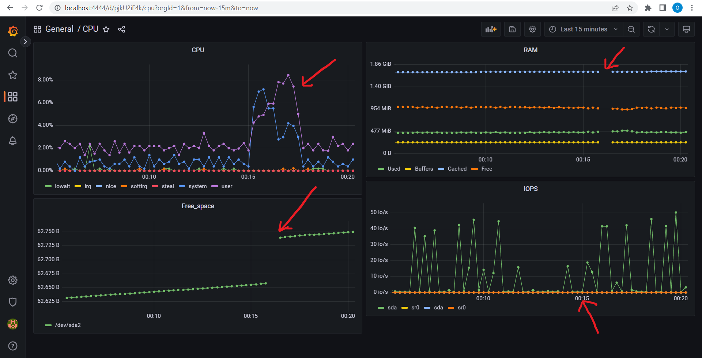
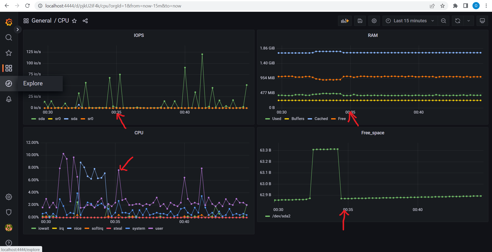

## Useful info ##

- Prometheus+Grafana+Node_exporter installation guide by VK Cloud: [click here](https://mcs.mail.ru/docs/additionals/cases/cases-monitoring/case-node-exporter#)

- Node Exporter guide: [click here](https://prometheus.io/docs/guides/node-exporter/)

- Building Grafana Dashboard on YT: [click here](https://www.youtube.com/watch?v=YUabB_7H710)

## Part 7. **Prometheus** and **Grafana**

> Install and configure **Prometheus** in virtual machine

[Prometheus instalation tutorial](https://linuxopsys.com/topics/install-prometheus-on-ubuntu)

> Install and configure **Grafana** in virtual machine

    wget https://dl.grafana.com/oss/release/grafana_9.2.4_amd64.deb && sudo dpkg -i grafana_9.2.4_amd64.deb && \
    sudo systemctl enable grafana-server && sudo systemctl start grafana-server
---

> Install and configure **Node Exporter** in virtual machine

    VERSION="1.4.0"
    wget https://github.com/prometheus/node_exporter/releases/download/v$VERSION/node_exporter-$VERSION.linux-amd64.tar.gz -O - | tar -xzv -C /tmp
    cp /tmp/node_exporter-$VERSION.linux-amd64/node_exporter /usr/local/bin
    chown -R prometheus:prometheus /usr/local/bin/node_exporter

Then create a file `/etc/systemd/system/node_exporter.service` with the following configuration:

```
[Unit]
Description=Prometheus Node Exporter
After=network.target

[Service]
Type=simple
Restart=always
User=prometheus
Group=prometheus
ExecStart=/usr/local/bin/node_exporter

[Install]
WantedBy=multi-user.target
```

Run node_exporter:

    systemctl daemon-reload
    systemctl start node_exporter.service-xzv -C /tmp
    systemctl enable node_exporter.service
    systemctl status node_exporter.service

Update a file `/etc/prometheus/prometheus.yml` and reload service:

    sudo cp ./prometheus.yml /etc/prometheus/prometheus.yml
    systemctl reload prometheus.service
---

> Access the **Prometheus**, **Grafana** and **Node Exporter** web interfaces from a local machine

 

- Prometheus: [http://localhost:9090/](http://localhost:9090/)

- Node Exporter: [http://localhost:9100/](http://localhost:9100/)

- Grafana: [http://localhost:3000/](http://localhost:3000/) - Login/Password for the first entrance is **admin/admin**

---

> Add to the **Grafana** dashboard a display of CPU, available RAM, free space and the number of I/O operations on the hard disk.

 

---

> Run bash script and check the hard disk load (disk space and read/write operations)



---

> Install the **stress** utility

    sudo apt-get install stress
---

> Run the stress command `stress -c 2 -i 1 -m 1 --vm-bytes 32M -t 10s` and check the hard disk, RAM and CPU load



---