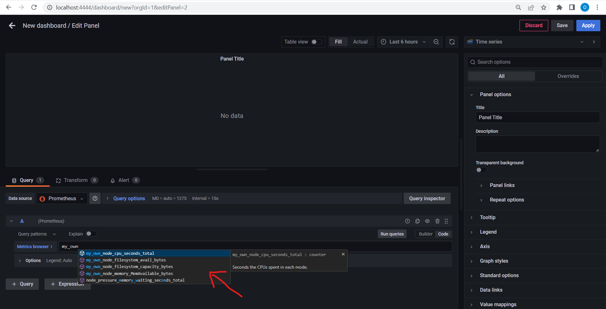
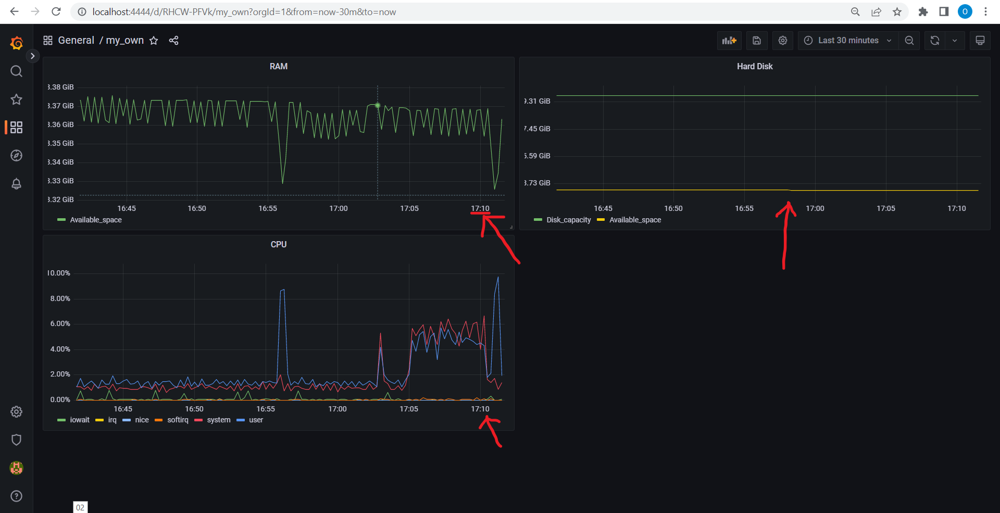

## Part 9. Your own node_exporter

> Create a file `/etc/systemd/system/my_own_node_exporter.service`:

    sudo cp ./my_own_node_exporter.service /etc/systemd/system/my_own_node_exporter.service

> Create directory `/etc/my_own_node_exporter` and copy bash script:

    sudo mkdir /etc/my_own_node_exporter
    sudo cp ./main.sh /etc/my_own_node_exporter/

> Run my_own_node_exporter service:

    systemctl daemon-reload
    systemctl start my_own_node_exporter.service
    systemctl enable my_own_node_exporter.service
    systemctl status my_own_node_exporter.service

> Update a file `/etc/prometheus/prometheus.yml` and restart service:

    sudo cp ./prometheus.yml /etc/prometheus/prometheus.yml
    systemctl reload prometheus.service
---

> Update nginx configuration file and restart service (don't forget to change path in first **server**):

    sudo cp ./nginx.conf /etc/nginx/nginx.conf
    systemctl reload nginx.service
---

> [Check](http://localhost:9110/metrics) your metrics in browser on the local host (don't forget to add port 9110 to the virtual machine)

> Finally, check your own metrics' existence in Grafana

---